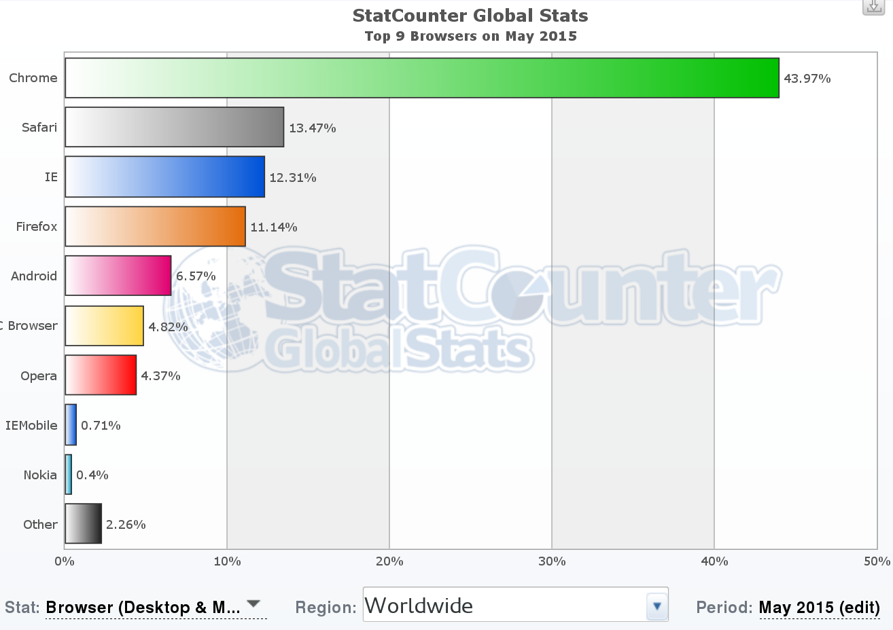
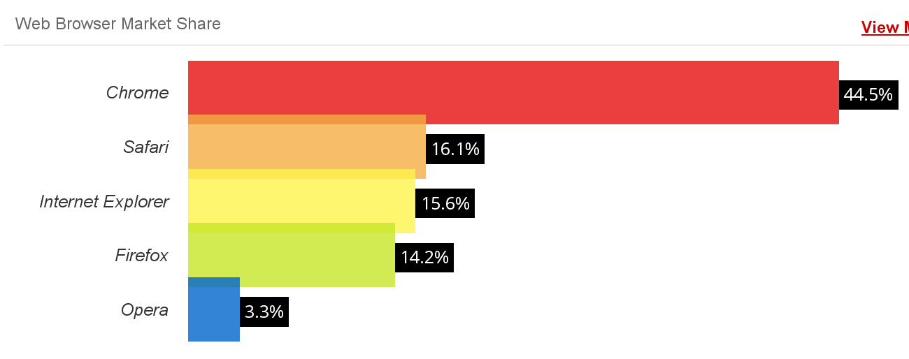
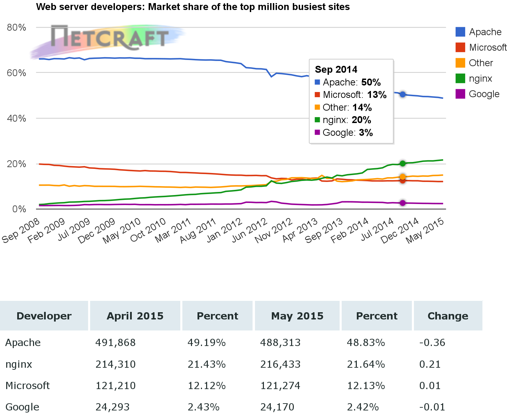
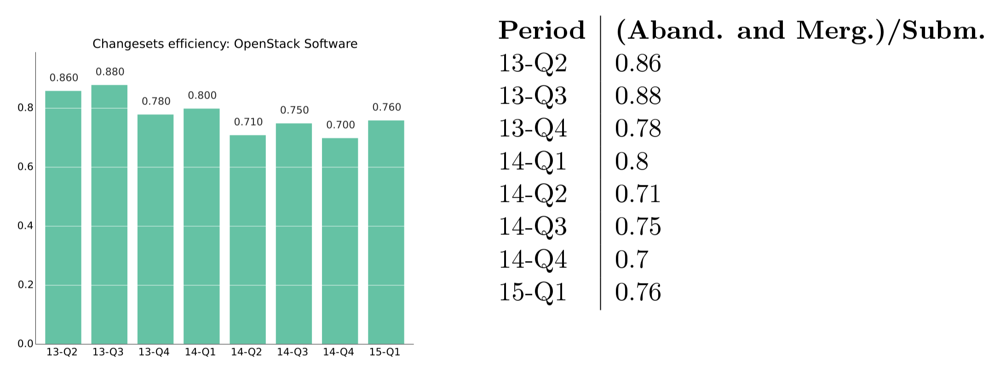
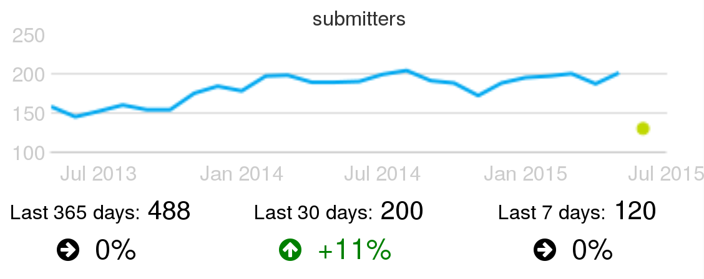
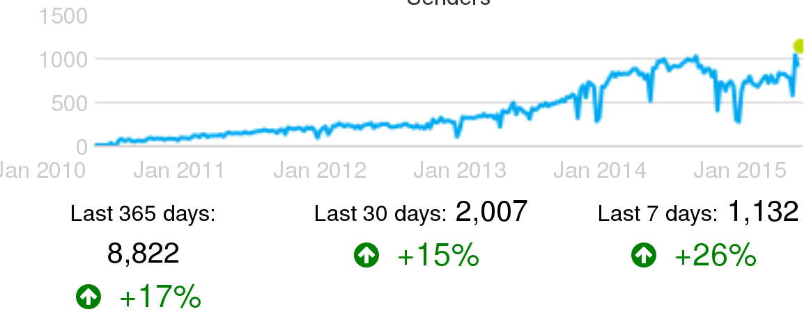
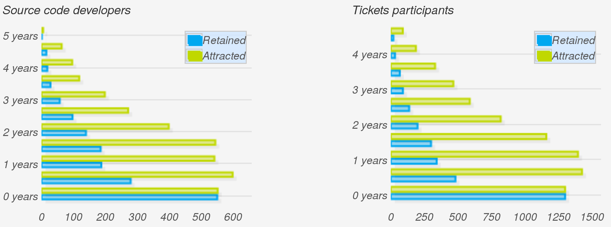
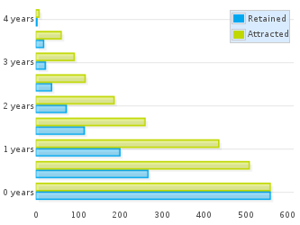
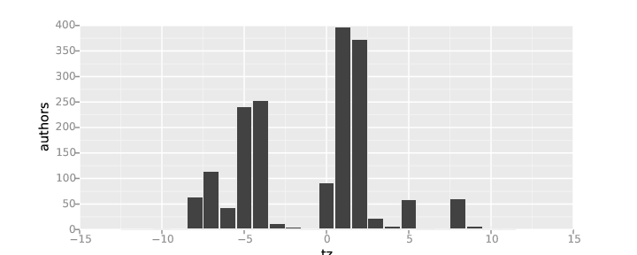
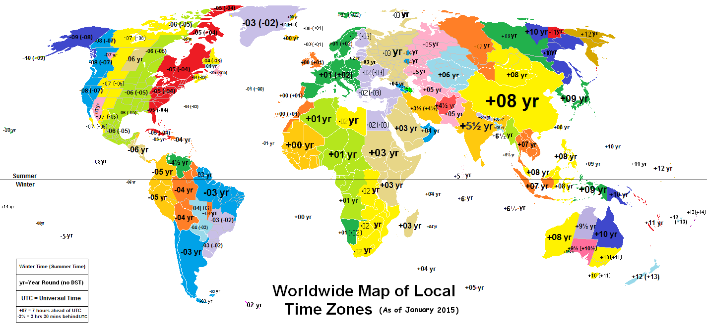

# Evaluation of FOSS communities

For many FOSS projects, the communities supporting them are the main responsibles for the evolution of the project. Evaluating the communities is therefore fundamental to evaluate the project.

## Different scopes: developers, contributors, users...

FOSS communities are diverse, and may include many different actors. But in general, attending to the scope, the following, usually overlapping, communities can be defined:

* The development community, composed by people in charge of developing and maintaining the software produced by the company.
* The contributing community, composed by all the people actively contributing, not only with code. Examples of contributors are: submitters of bug reports, participants in discussions in mailing lists, translators, writers of documentation, etc. The contributing community includes developers too.
* The user community, composed by users of the software participating somehow in the community. This can be by asking questions, by attending events, by joining social network groups with interest in the project. etc. Usually the user community includes the development and contributing communities, since they are also users of the system.
* The ecosystemn community, composed by all stakeholders not only in the project itself, but in all the ecosystem of projects related to it. The user community is a part of the ecosystem community.

We define these communities to hightlight different populations that may be relevant for an evaluation. It is important to realize that their borders are fuzzy, and people move from one to another as time passes.

For each of these scopes, different evaluation means can be used. Despite the apparent diversity, we can also identify some techniques and parameters that are useful for all of them.  The rest of this chapter will enter into the peculiarities of each community, and will show as well what they have in common and the techniques that are usful for evaluating all of them.

### Development community

The development community is composed of the persons developing and maintaining the products produced by the project: software and  related artifacts, such as documentation.

In the case of FOSS projects with open development models based on coordination tools, there is a lot of information available about them. Usually, data can be collected from the following repositories:

* Source code management repository. Almost all the information in is produced by the development community, since they are mainly changes to source code. In fact, one of the ways of defining the development communuity is as "those people who have contributed at least one change".
* Code review system. All reviewers can be considered as a part of the development communities. Most of the submitters of change proposals are also developers, or they are acquiring that status.
* Issue tracking system. Developers participate in ITS by opening, commenting and closing tickets. They are not the only ones opening or commenting, but usually only they can fix issues, and close tickets.
* Asynchronous and synchronous communication. It is very usual to have separate channels for developers, which allow for a separate tracking of this community.

In summary, most of the data in those SCM, CRS and ITS repositories are related to development activities, and developers usually have separate channels in ACS and SCS. Therefore, the evaluation of the development community in open projects, where all these repositories are public, can be very detailed.


### Contributing community

The contributing community is a bit in between the development community and the user community. Contributors are usually users that are in the road to become developers. But they may or may not walk that path towards the development community. This makes it difficult to specifically track contributors who are not developers.

* Issue tracking system.  Tickets are opened by contributors, be them developers or not. Since we consider both feature requests and bug reports as valuable contributions to the project, everything happening in the ITS is performed by the contributing community. However, the "responisve" part of the action is carried on by developers.
* Asynchronous and synchronous communication. Contributors may join development channels. But being they users as well, contributors are also present in user channels. This makes it difficult to track their activity, except that they can be identified in ITS, and their identity linked to ACS and SCS.

Since the difference between "contributor" and "developer" is a specially fuzzy one, in many cases both communities are considered as one. However, in some sense contributors are the pool where developers come from. People usually become developer after contributing to the project for a while. Therefore, for estimating the future of the development community, and the engagement of people who could become developers, studying the contributor community is specially interesting.

### Users community

The community of users of a FOSS projects is much more difficult to evaluate than those of contributors and developers. In fact, even estimating the number of users is usually difficult. Usage is in most cases passive, in the sense that almost no interaction with the project is needed to become user. In most cases of non-FOSS software, to become user implies purchasing a license, which is an action that can be tracked. But in the case of FOSS software, it is enough to get the software somehow, and start using it. No red tape is involved.

Therefore, the source of information to estimate the size of the community of users are indirect:

* Downloads. Many projects maintain a download area. When the primary usage of the product is via those areas, the number of downloads can be an estimator of the number of users. Of course, downloads of different releases have to be taken into account, and some model on when users reinstall with a newer version are needed. But this method can be enough to estimate trends and order-of-magnitude numbers. Of course, if most of the usage is not by direct download, the numbers are much less precise. This happens, for example, when the software is mainly available through FOSS distributions or via third party download areas.
* Questions and comments in user forums. Given that the ratio of users to contributors is very large in most cases, it can be assumed that questions and comments about the product in third party forums are mainly by users. Therefore, the number of those questions and numbers can be a proxy for estimating the user population. Some models to convert those numbers into number of users are needed, but again trends over time can be somewhat accurate.
* Presence in FOSS distributions. Some FOSS distributions maintain their own statistics about package (and therefore, product) installation. For example, in Debian the opt-in Popularity Contest maintains accurate stats of installed packages. From those numbers, and estimating the total population of Debian users, total usage in Debian can be estimated. From there, estimations for other distributions can be extrapolated. These numbers are probably not very accurate, but can provide an order-of-magnitude estimation.
* Answers to polls and surveys. Polls and surveys to specific populations or to the population in general can also be a source of information. This is a general technique to know about user adoption, which compared to the others has the main drawback of its cost. Only the really popular FOSS products will appear in general surveys, but in some cases this is enough to have an idea. For example, the usage of Firefox or Chrome web browsers can be estimated this way.
* Raw numbers in the Internet. Some services, such as Google trends, provide some information about how popular terms are in the web. In some cases, those numbers can be used to estimate trends in usage, assuming that the more popular a product, the more people appearences it will have in the global web.

There are some specific cases when a more concrete estimation, or at least a lower watermark for an estimation can be established:

* Software sending "beacons" to the project. This can be desktop or mobile software connecting to a certain location with a "Here I am" message, or a web product including components that are downloaed from a certain website. In both cases, since FOSS software can be changed, maybe there are versions of the product with the beacon removed. In addition, maybe there are products being used withouth Internet connection. But when these cases can be neglected, the estimation of usage can be very good. A very specific case is when the software, as a part of their normal functioning, identifies itself somehow. For example, web browsers send identification strings to web servers. These strings can be used to estimate usage.
* Software which answers when queried. This a very specific, but very accurate case, when the software can be located and queried. The most well known case is the estimation of web servers, where the user base of Apache or nginx is tracked periodically by querying web servers all over the world for their identification string.
* Software distributed through markets. When the product is distributed mainly through a market (a mobile or a distribution app market), usually it provides detailed numbers about installations, deinstallations, etc.

These three cases are rare, but when they happen, estimations can be very accurate. The next pictures show some cases (web browsers, web servers) for which these methodologies can be used. That allows for the usage estimation of some FOSS products, such as Apache HTTP Server, nginx, Chrome or Firefox.



*Example of usage estimation: [StatCounter top 9 browsers (May 2015)](http://gs.statcounter.com/#all-browser-ww-monthly-201505-201505-bar), top, and [W3Counter web browser market share](http://www.w3counter.com/globalstats.php) (May 2015), bottom. Both surveys are performed by using the identification information from web broswers in large collections of web sites. It is interesting noticing how they differ, even when they seem to use similar methodologies.*


*Example of usage estimation: [Netcraft web server survey (May 2015)](http://news.netcraft.com/archives/2015/05/19/may-2015-web-server-survey.html). This survey is performed by querying web servers (in this case, the top million busiest sites) for their identification string.*

### Ecosystem community

The ecosystemm community is a kind of mega-community, including all the communities relevant to the project under evaluation. All the above comments for developer, contributing and user commities apply, since all of them are representer in this ecosystem community. But at the same time, there are more overlappings, since many developers, contributors or users may be in many of the communities in the ecosystem.

The ecosystem community is difficult to study because it is usually large, and is spread through many different infrastructures. In fact, the first problem to address is to find out all the projects that form a part of it, since interrelations between components can be complex. However, this mega-community is very important for the long term sustainability of the project under evaluation. Usually, resources for most projects, including developers and users, come primarily from their ecosystem communities. Some of them can work as attractors, bringing new resources to the ecosystem community from the outside world. Of course, identifying those projects that create and nurture an ecosystem community is very important to understand long term trends in FOSS techologies.

Just as an example, when studying the ecosystem for a GNOME application, all the GNOME ecosystem has to be taken into account, because it will be relevant for the future of the project. For example, if basic GNOME libraries stop evolving, it is difficult that the application keep pace with puture needs.

From another point of view, the definition of the ecosystem, and therefore of the ecosystem community, is something that depend on the objectives of the evaluation. The ecosystem can be defined only for those projects with strong ties and great dependency, or for all those on which the project depends to some extent. The former case is the most usual, since dependencies and relationships are easy to perceive. But the latter can lead to important conclussions, such as when many projects discoverd that they were hit by the Heartbleed bug, deep in a software produced by a handful of developers, which was included in many, many very popular programs.

## Common techniques

In addition to the analysis of the sources of information detailed in the previous chapter, there are some techniques that can be applied, mainly to find out about the non-developer communities.

### Surveys and interviews

Surveys and interviews can help to obtain information that cannot be inferred from the project repositories. This can be because the needed information is not available in such repositories, or because the target population is not using them.

An example of the first case is the effort devoted to develop software. It an evaluation parameter is the effor that a project puts into development and maintenance of the software, for example in aggregated person-months, that is not an information that can be reliablily extracted from repositories. But it can be obtanined if developers answer a simple survey.

An example of the second one is user satisfaction. In some cases, a web-based survey where users rank a software with a five-stats schema may be enough. The main trouble here is to reach a sample of users representative enough of the user population for the survey to be statistically significant.

Some projects do this kind of surveys on a regular basis, publishing their results. The main trouble with such surveys is that they are not comparable from project to project, which means that usually new surveys are needed, which is a time consuming and expensive procedure. It would be very coonvenient for evaluators that FOSS projects agreed on some common questions to developers and users, and standarized some surveys that could be used for the most common evaluation scenarios.

Interviews to experts on a project are also a good source of data. Open or directed interviews provide mainly qualitative information about a community, which can enrich or complement quantitative information obtained by other means.

### Traces in collaboration systems

All communication systems which can be analyzed can provide useful information for some kinds of community evaluation. It was already mentioned how ACS and SCS, as defined by the project, can be valuable sources of data. But other external communication channels can also help. For example, mentions in Twitter or other social networks, and even sentiment analysis on those mentions can say a lot about how the project and its community are perceived.

### Evaluation of documentation and third party studies

Documentation can also provide details about the community. In some cases, the very availability of docuemtation, or certain kinds of documentation, is a relevant fact for users. In some others, user-generate documentation can also e a proxy for estimating some parameters, such as user involvement in the project.

The documentation generated by the project itself in some cases describes some details about the community. For example, developer documentation usually describes the repositories and communication channels used by the project, which can be the source for empirical analysis of those repositories. Documentation can be useful as well for determining project policies with respect to participation, structure and decission making in the community.

## Evaluating activity

One of the aspects of a community that are most usually evaluated is activity. In this context, evaluating activity refers to finding signs and traces of activity performed to make the project advance towards its goals. Activity can be of different kinds, such as:

* committing patches to the source code management system
* reporting, commenting or fixing bugs in the issue tracking system
* submitting patches or reviewing them in the code review system
* sending messages to mailing lists or synchronous communication systems

Not all the activity is observable, and suitable for evaluation. For example, in mailing lists it is easy to know when a message is sent: it is enough to explore the list archive. But it is difficult to know who received that message (the list recipients is usually not public), and almost impossible to know who read it (reading is a private activity performed in your own mailer program).

But the observable activity is usually good enough to know about the heartbeat of the project, about how many people is active in different roles, and about the general trends. 

There are several analysis of activity suitable for evaluation. The most common are:

* Parameters reflecting activity for a certain period. For example, number of changes to the source code for the whole history of the project, or number of messages sent to mailing lists of the project during a certain week.
* People active for a certain period. For example, people fixing bugs during a release period, or people providing code review advise during the last month.
* Evolution of any of them. For example, new tickets per month for the whole live of the project, or messages sent to IRC channels per week.
* Trends for any of them. For example, increase (or decrease) in number of messages posted in the forums for the project from December 2014 to January 2015.


*Number of commits per month for Puppet, as [shown by Grimoire Dashboard](http://bitergia.dev.puppetlabs.com), circa June 2015. Trends for the last year, month and week are shown as well.*

Parameters by themselves only provide a first hint. Saying that a project is performing 2,303 commits in one month is a first indicator about how active is the project, but doesn't provide too much information. Putting it into context starts to make things more interesting. For example, comparing two projects with similar functionality, but one of them committing five times the other, is a first step towards comparing their activities.

However, commit patterns may be very different from project to project, and a simple comparison may be misleading. For example, one of them may be committing a very single change proposal, just to improve them later. Another one, meanwhile, may be following an stringent code review process, committing only after several iterations that improved change proposals. The first pattern will produce much more commits than the second. The same can be said for other parameters.

Comparisons within the same project are usually much more interesting and fair. If the project didn't change policies nor patterns during the last two months, comparing activity parameters will provide a good idea of trends. Comparisons over larger periods of time will allow for detecting the impact of changes in policies, tools or patterns. For excample, changes of the source code management system, or the introduction of code review, or policies on closing old tickets are reflected in the long-term charts about activity. And of course, growth, stagnation or decrease in activity can be clearly perceived over time.

In addition to the raw parameters on activity, the parameters related to persons performing that activity are also relevant. They allow for a first characterization of the active community in several areas. An exponential growth in code authors, or a steady decline in bug fixers will certainly be interesting subjects of further analysis.

Several of these parameters together show a multifaceted view of the project. As an example, next figures show a summary of activity of the same project, OpenStack, as shown in three different dashboards: Grimoire, Stackalitics, and Open Hub.


*Activity in OpenStack: summary of activity in serveral repositories over time, as [shown by Grimoire Dashboard](http://activity.openstack.org), circa June 2015.*

The Grimoire Dashboard shows activity in each kind of repository, which allows for easy comparison, while at the same time the general trends of activity in the project are visible. It shows some metrics about the people active in different roles.


*Activity in OpenStack: summary of code merges over time, and split by company and module, as [shown by Stackalytics](http://stackalytics.com), circa June  2015.*

Stackalytics focuses on changes merged, although it shows other activity as well. The summary includes activity by company and by module.


*Activity in OpenStack: summary of activity over time, as [shown by Open Hub](https://www.openhub.net/p/openstack), circa June 2015.*

Open Hub shows a chart with the history of the activity, and some factoids about it, with a focus on activity in the source code management system.

### Activity in source code management

Activity in source code management reflects how the project is producing changes for the products they build. Source code management stores "commits", each of them being a change (or "patch") to the source code. Each change is different in nature, size, complexity, etc., which makes it difficult to compare individual changes. However, when we consider large collections of changes, trends become apparent.

In particular, when a project has pre-merge code review, this is a metric very difficult to cheat. If a developer tries to split a commit in several, for increasing the personal commit count, code reviewers would complain. Usually, the very possibility that this happens is enough for discouraging developers who could be tempted to split commits.

However, it is important to realize that a single commit can be very important for the project, and be the result of a great effort. This is speciall the case when we're looking at the numbers of a specific persons, instead of aggregate numbers. Therefore, commit counts should not be used as a basis of rewarding systems, for example.

When used properly, commit counts can be a good estimator for total effort. Recent studies show how above a certain number of commits per month, it is very likely that the developer works full time in the project. Numbers below that threshold can be prorated to estimate a fraction of full-time effort. This threshold is dependent on the project, but is usually around 10-15 commits per month, in complex systems with code review and continuous integration. 

### Activity in code review and ticketing systems

In CRS, activity is usually measured as the number of completed (or started) review processes per period. In the case of core reviews where different versions of the proposed change can be submitted, the total number of versions submitted for review is also significant.

It is important to notice that when pre-merge code review is in place, the number of code review processes ending in a merge is equal to the number of commits. However, the metrics may show some differences depending on the dates considered. For reviews, either the date of the starting or finishing of the process may be considered. For commits, the date of authorship, or the date of commit (usually the date of the merge).

The number of review processes are good indicators of the volume of the review process. Even when not all reviews require the same effort or have the same complexity, aggregated numbers tell a lot about the resources needed for the code review processes.

The number of review processes ending in merge or abandon is also important. In fact, the difference between new code reviews, and merged plus abandoned code reviews for a period of time is an indicator of whether the project is coping with all proposed changes, or not.

In the case of ITS, activity is measured either in terms of open tickets, or closed tickets. In fact, both are important indicators, and their difference shows whether the project is coping well with new tickets. The number of state changes, and the number of comments to tickets, are good indicators of activity as well.

For both systems, efficiency in closing is an important factor. It is the ratio of new tickets or review processes to closed tickets or finished (merged or abandoned) review processes. When this number is larger than one, that means that the project is opening more than closing, which is a problem in the long term. If it is lower than one, the project is "recovering old workload", by closing more issues than they are being opened.


*Example of efficiency: [new versus closed review processes in OpenStack, 2015, first quarter](http://activity.openstack.org/dash/reports/2015-q1/pdf/2015-q1_OpenStack_report.pdf).*

### Activity in communication systems

Activity in communication systems is usually measured in messages. But messages in different kinds of communication systems may be very different. For example, it is usually much longer to write an email message than to write a one line comment in an IRC channel. This means that metrics from one system cannot be compared with metrics from another one, even if they are similar.

But nummbers for different points in time can be compared, whcih allows for detecting trends, and even estimate the amount of effort needed to track all communication channels for a project. Since core developers may need to track all of them, this is a first estimation of how the communication cost is hitting producitivity.

## Active persons

In addition to activity itself, knowing who are the persons causing that activity is very important when evaluating a community. Active persons in a project can be measured in several repositories:

* SCM: In modern SCM systems, such as git, authors and committers can be counted separately. Authors are persons authoring changes to source code. Committers are persons commiting those changes to the repository. Authors can be also committers, if they have commit rights. But if they don't, usually they send their changes to committers, who are those merging them into the repository. However, sites such as GitHub ot GitLab make things more complex, since when the changes are contributed via the web interface, as pull requests, authors are considered as committers even if they don't have commit access to the repository.


*Example of active persons: Active authors per month in the Puppet project, circa June 2015.*

* CRS: Code review systems allow for the identification of several populations of active persons: change proposers (initiators of review processes), reviewers, rejecters (reviewers rejecting changes, asking for new versions), accepters (reviewers accepting changes), and abandoners (submitters abandoning a proposed change).


*Example of active change submitters: Active summitters of proposed changes for code review, per month, in the Wikimedia projects, circa June 2015.*

* ITS: The main active populations to track are ticket openers and closers, and people participating by changing states or commenting. Openers are persons contributing with new bug reports or feature requests. In many cases they are not developers, but people hit by a bug, or needed a new feature, and engaged enough with the project to devote some time to file the new ticket. People changing stated and closing tickets are very likely developers in the project. People commenting are either developers, or non-developers (maybe the one who submitted the ticket) collaborating in the bug-fixing or feature-implementation processes.


*Example of active ticket closers: Active people closing tickets, per month, in the CloudStack project, circa June 2015.*

* Communication channels: In most communcation channels, be them synchronous or asynchronous, active persons that can be measured are senders (or posters). In most of these systems the information about who is actually reading, or even receiving, those messages sent is not easy to obtain, or does not exist. In the systems that allow for it, the number of persons actively answering or following-up to a message is interesting as well.


*Example of active senders in IRC channels: Active people sending messages in IRC channels, per week, in the OpenStack project, circa June 2015.*

Of course, in addition to the raw numbers of active persons, the ratio of any parameter showing activity to the numbers of the group causing that activity is specially relevant. For example, the ratio of commits to authors of those commits over time shows quickly if the number of commits per author are growing or not.

## Merging identities

For most of the studies based on tracking persons, it is important to merge all identities that a single person may have in the repositories in a single merged identity. That can be done at four levels:

* The repository level. That consists of merging all the identities of the same person in a given repository. For example, meging all your identities in a certain git repository. This is useful, for example, to count the real number of people working in that repository.
* The repository kind level. In this case, all the identities of the same person, across all the repositories of the same kind for a certain project, will be merged. This is useful for studies for all repositories of the same kind. For example, for counting the total number of developers contributing to source code, and thus to git repositories, of a certain project.
* The project level. In this case, all identities of the same person, across all the repositories of any kind of the same project will be merged. This is needed to know about persons at the project level, such as for evaluating the population of contributors of a project across all its repositories of any kind.
* The global level. All identities for a certain person, in any repository of any analyzed project, is merged into a single merged identity. This is useful when tracking people working in several projects. For example, for finding developers working both in project X and project Y.

In some cases, the projects keep some information to track the multiple identities of developers. But in most cases, you can only relay on heuristics and in manual comparison and merging of identities. There are many heuristics that can be used, but they can be tricky depending on the circumstances, over- or underperforming in specific projects. One example is comparison of email addresses when the complete name string matches. To illustrate this heuristic, let's use the following email addresses:

```
Jesus M. Gonzalez-Barahona <jgb@bitergia.com>
Jesus M. Gonzalez-Barahona <jgb@gsyc.es>
```

A heuristics finding exact matches in names would correctly merge these two indentities. But now consider the same heuristics applied to these two addesses:

```
John Smith <john@somecompany.com>
John Smith <js@someothercompany.com>
```

Given that John Smith is a very common name, it could perfectly be the case, specially in a large community, that those identities correspond to different persons, and therefore shouldn't be merged.

In general, this happens with any heuristics you may find out. That is the reason why usually the merging of identities is really a mix of applying heuristics and manual check of the identities. Of course, when the project itself is involved, and the real persons whose identities are merged collaborate, the process can be reviewed by them. This is the better way of ensuring accuracy.

As was commented at the beginning of this section, the most accurate this merging process is, the better estimation of parameters that depend on identfying persons, and not identities.

## Aging

Of the many aspects to explore in the community of a FOSS project, turnover and age structure are some of the more important. Turnover shows how people are entering and leaving the community. It tells how attractive is the community, and how it retains people once they join. Age structure, understanding age as "time in the project" shows for how long members have joined it. It tells how many people are available in different stages of experience, from old-timers to newbies. Together, both can be used to estimate engagement, to predict the future structure and size of the community, and to detect early potential problems that could prevent a healthy growth.

### The community aging chart

Both turnover and age structure can be estimated from data in software development repositories. A single chart can be used to visualize turnover and age structure data obtained from these repositories: the community aging chart. This chart resembles to some extent the [population pyramid](http://en.wikipedia.org/wiki/Population_pyramid) used to learn about the age of populations. It represents the "age" of developers in the project, in a way that provides insight on its structure.


*Example of aging charts: [Community aging charts](http://activity.openstack.org/dash/browser/demographics.html) for authors of code, as found in git repositories of the OpenStack project (left) and ticket participants, as found in the OpenStack Launchpad (right), circa June 2015. Each pair of blue and green bars corresponds to a generation of six months.*

In the aging chart, each pair of two horizontal bars shows how a "generation" is behaving. The Y axis represents how old is each generations, with younger ones at the bottom. For each generation, the green bar (attraction) represents the number of people that joined it. In other words, how many people were attracted to the community during the corresponding period (say, first semester of 2010). Meanwhile, the blue bar (retention) represents how many people in that generation are still active in the community. In other words, how many of those that were attracted are still retained.

### One chart, many views

The aging chart shows many different aspects of the community. Let's review some of them.

The ratio of the pair of bars for each generation is its retention ratio. For the newest generation, it is 100%, since people recently entering the community are still considered to be active (but that depends on the inactivity period, see below). A ratio of 50% means that half the people in the generation are still retained. Comparing the length of each pair of bars, we can quickly learn about which generations were most successfully retained, and which ones mostly abandoned the project.

The evolution of green bars tells us about the evolution of attraction over time. Most successful projects start with low attraction, but at some point they starts to become very attractive, and the bars grow very quickly. When a project enters maturity, usually its attraction becomes more stable, and can even start to decline, with the project being still extremely successful, just because it is no longer "sexy enough" for potential newbies.

The evolution of blue bars tells us about the current age structure of the community. If bars in the top are large, but those in the bottom are small, the community is retaining early generations very well, but having difficulties with retain new blood. On the contrary, if bars in the top are small while those in the bottom are large, newcomers are staying, while experienced people already left. Blue bars can only be as large as green bars (you cannot retain more people, for a certain generation, that those that you attracted to it). Therefore, "large" and "small" for blue bars is always relative to green bars.

### Different charts for different information

To build the community aging chart, three parameters have to be considered: generation period, inactivity period, and snapshot date:

* The generation period defines how long generations are: that is the granularity of the chart. It is usually one year, or maybe six months for younger communities. People in the community is going to be charted according to their generation, using this granularity.
* The inactivity period is how long we wait before considering that somebody left the community. We don't know if persons really left the community: maybe they are on vacation, or on a medical leave. So, we have to estimate that "if somebody was not active during the last m months, we consider that person as a departure from the community". That m is the inactivity period, which is usually equal to the generation period, but could be different.
* The snapshot date is when we consider as "now". That is, we can calculate the the community aging chart for today, but also for any time in the past. In fact, comparisons of charts for different snapshot dates say a lot about the evolution of the attraction and retention of the project over time.

Comparing a community aging chart from the past with the current one let us compare the potential we had some time ago with the reality now. In most development communities, people inactive for a long period are very unlikely to show up again. That means that the sum of the retention bars in the chart snapshoted two years ago are the maximum population that the community is going to have two years later, save the generations entering during these two years.

## One example and some comments

As an example, we can compare the aging chart for OpenStack in July 2014 with the same chart for July 2013. Both charts show six-month generations and use six month inactivity period as well. Obviously enough, the latter includes two bars less, those corresponding to the two last generations, who still had not joined the project in July 2013. Green bars corresponding to generations more than one year old in July 2014 are exactly the same as those in the chart for July 2014, only shifted by one year. If a generation attracted a number of people, that does not depend on when we set the snapshot.


*Aging chart for authors in OpenStack git repositories in July 2013*


*Aging chart for authors in OpenStack git repositories in July 2014*

If we focus now on the one-year-old generation for July 2013 (the third one, counting bottom-up), we can see how it is represented one year later. From a total of about 190 persons attracted, about 100 were still retained in July 2013. That means that in July 2014 we could expect at most 100 persons still retained in that generation. Now, fast forward to the future: in the chart for July 2014, about 70 persons are still retained from the (now) two-years-old generation. In other words, the project lost a much higher share of the generation during the first year than during the second one, even if we consider the latter case relative to those that still were in the project in July 2013.

This is a very common fact found in most projects: they lose a large fraction of attracted persons during the first year, but are more likely to retain them after that point. This depends as well on the policies of the project, and how you enter the community. Retention ratio for the first year usually reflects more than anything how difficult it is to enter the community. The more difficult it is to get in, usually the most engaged people are, and the less likely to leave quickly. But the more difficult it is to get in, the less people in the newer generation are going to be attracted. Therefore, projects with different entry barriers can attract very different quantities of people, but maybe the retained people after one year is very similar. Of course, volunteers and hired developers have different entry / leave patterns too, that influence these ratios.

We can also read the future a bit. Assuming the current retention rates per generation, we could estimate the size of the retention bars for the future, and from it the total size of the community with a certain experience in the project. For example, all those staying more than two years in the project in one year from now, are in the blue bars corresponding to generations currently older than one year. This allows for the prediction of shortages of developers, or of experienced developers, for example.

In fact, any policy oriented to improve attraction or retention of people can be easily tracked with these aging charts, by defining the ideal charts for the future, and then comparing with the actual ones.

## Time zones and other geographical information

Knowing about the geographical location of the members of the community is difficult. In some projects, when people register in the project, they can enter some geographical information. That can be the country or city of residence, or even their coordinates. As an example, see below the map of Debian developers (well, in fact, the map of some of the Debian developers, who specified their location).


*Example of geographical information for a community: [Map showing Debian developers location](https://www.debian.org/devel/developers.loc), for those developers who registered their coordinates.*

But having this level of information is unusual, and usually incomplete, since it covers only community members who want to fill in this information.

When the project records IP addresses accesing its infrastructure, they can do IP geo-location on them. Since different types of access can be tracked (access to the development repositories, to the downlowad area, to the forums, etc), those projects can track with detail the location of different actors in the community. But again, this is unusual. Most projects don't have these capabilities, or don't want to put this tracking in place.

For projects willing to have some information about the geographic location of their community, but not using the former techniqueus, there is still something to be done: time zone analysis.

The main advantage about time zone analysis is that it uses geographic information that individuals provide when using some repositories. Well, as is usual in these cases, it is not exactly individuals, but the software they use. The most two widespread cases are git and mailers:

* git clients include the local date when commits are created. When those commits are acccepted, merged in other repositories, etc. the time (including the time zone tag) are not altered in most cases. Please, note that we said "in most cases": some actions on commits will alter their time, usually setting the time zone tag to that of the person performing that action. But still, the information is reliable enough to know about the time zones for commit authors.


*Example of timezone analysis: Number of git authors per time zone, repositories for the OpenStack project, during 2014.*

* Mailers include the local time, including time zone tags, in messages sent. In many cases, mailing list software keep this time. When that is the case, the analysis of mailing list repositories permit the identification of time zone for senders.


*Example of timezone analysis: Number of messages per time zone, sent to Eclipse mailing lists during 2014*

In both cases, it is important to notice that there are at least three sources of trouble with this time zone analysis:

* Bots that perform commits or send messages. They can have their local time zone set to whatever is convenient for the machine where they reside. Since in some projects bots can do a lot of these actions, the number of messages or commits per time zone can be greatly affected because of this.
* People setting their time zone to something else than their time zone of residence. For example, frequent worldwide travellers, or persons with intense interactions with people in other timezones, may have their time zone set to UTC+0 (universal time, formerly Greenwich time). This means that the time zone corresponding to UTC+0 can be overrepresented because of this fact.
* Many countries are in fact in two timezones, since they change time in Summer (Summer savings time).


*Map of world time zones. Original: [Worldwide Time Zones (including DST)](https://commons.wikimedia.org/wiki/File:Worldwide_Time_Zones_%28including_DST%29.png), by Phoenix B 1of3, Creative Commons Attribution-Share Alike 3.0 Unported*

Due to the distribution of population on the Earth, timezone analysis provides a very high level glimpse of the geographical distribution of the community. There is no way of telling European from African contributors, for example, since they are in the same timezones. But you can roughly identify persons from several regions (the list is not exact, look at the map for details and a more accurate description):

* UTC+12: New Zealand
* UTC+10, UTC+11: Australia
* UTC+9: Japan, Korea.
* UTC+7, UTC+8: China, Eastern Russia, Indochina.
* UTC+6: India (in fact, it is UTC+5:30).
* UTC+3 to UTC+5: Western Russia, East Africa, Middle East.
* UTC+0 to UTC+2: Western and Central Europe, West Africa.
* UTC-2, UTC-3: Brazil, Argentina, Chile.
* UTC-4 to UTC-6: North America Central and East Coast (US, Canada, Mexico), Central America, South America West Coast. 
* UTC-8, UTC-7: North America West Coast (US, Canada).

For some uses, this split in regions is enough. For example, in the above chart about OpenStack git auhtors it is clear how most of the developers are from North America and Western Europe, with some participations of the Far East and other regions. But the distribution of the Eclipse mail senders is even more centered in Western Europe, with a large participation from North America, a only some presence from the rest of the world.

This kind of study is enough to assess the results of policies for increasing geographical participation, or to know where developers come from to decide on a meeting location.

## Time of collaboration

In global communities, knowing when people is working is important for many issues. For example, for deciding on coordination synchrounous distance meetings, for estimating to which extent the work on issues may be continuous because there are people working at any time, or to know about work timing patterns in the project.

People work at different times of the day due to being in different time zones, but also due to different working habits. For example, many people working for companies tend to follow the office hours schedule, from 8 to 5 or similar. But volunteers tend to work on their spare time, that is in the evenings and during the night. The same can be said about day of the week: office workers tend to be active from Monday to Friday, while volunteers tend to work also during weekends. There are similar differences in vacation periods too.

These work patterns can be estimated from dates in almost any of the repositories that we can use as data source, since activity is usually tagged with a time. This allows for very detailed analysis of when people perform that activity.

## Affiliation

In FOSS communities, many develpers are not working as volunteers, but as paid workers. In this case, it may be important to know for which organization each of these developers is working. Knowing it allows for several kinds of higher level studies, such as diversity in organizations contributing to a project, or how each organziation collaborates with others. In general, any study that can be performed at the person level, can be performed at the organization level just by aggregating the activity of all their employees.

The basis of these analysis is therefore identifying to which organziation is affiliated each developer, if any, and during which time period. In some cases, this information is maintained to some extent by the projects themselves. For example, the Eclipse Foundation and the OpenStack Foundation maintain detailed affiliation information for all their committers. But even in those cases, there are other people, such as casual posters to mailing lists, that cannot be identified in a coompulsory way, and who have little motivation to collaborate in any affiliation tracking schema maintained by the projects.

There are other techniques that may work in a certain fraction of the cases to track affiliations. It is important to notice how this problem is related to the merging of identities, which was mentioned earlier in this chapter. Assumming that the merging of identities is already done and accurate, some of the techniques for finding affiliation information are:

* Using domains in email addresses to identify companies. Not all domains are useful for this. For example, @gmail.com or @hotmail.com refer to the mailing system that the person is using, and has nothing to do with the organization for which they are working. But many other addresses, such as @redhat.com, @ibm.com or @hp.com can be easily tracked to Red Hat, IBM or HP. An specific case when this technique doesn't work is when there is a project policy or tradition of using project addresses. Thuius is the case, for example, of Apache, with @apache.org addresses, customarily used by Apache developers in activities related to the project. Obviously, those addresses have no use for fiinding affiliations.
* Getting listitgs from involved companies. Companies contributing to a project may maintain such listings for their own interest. If they are willing to share them, they are a precious source of information to assign affiliation. An specific case of this is when the project itself tries to track affiliation for all contributors, as was commented earlier.
* Internet searches. People can be usually found in social networks, web pages, etc. From the information found in those places, in many cases their affiliation (at least their current afiliation) can be inferred.

Once affiliation information is available, any community study can be done by organziation. For example, the next chart shows the most active companies (by changes merged) in the OpenStack project.


*Example of organization analysis: Top ten organizations in OpenStack by number of commits and number of authors of commits for the whole history of the project up to November 2014.*

## Diversity

In FOSS projects, diversity is important. Diversity ensures that dependencies on certain people, or on certain companies, are not a risk for the future of the project. Diversity ensures that control of the project is not in the hands of a few people. Diversity helps to have a healthy community, and lowers the barriers for new people to join the community.

There are several metrics for diversity, some of them are:

* [Bus factor](https://en.wikipedia.org/wiki/Bus_factor): Number of developers it would need to lose to destroy its institutional memory and halt its progress.
* [Apache Pony Factor](https://ke4qqq.wordpress.com/2015/02/08/pony-factor-math/): Diversity of a project in terms of the division of labor among committers in a project.

### Bus factor

The bus factor tracks the concentration of unique knowledge on the software in specific developers. The name "bus factor" comes from the extreme scenario "What would happen to the project if a bus hits certain developers?". The first formulation of this question is attributed to Michael McLay, who in 1994 [asked what would happen to Python](http://legacy.python.org/search/hypermail/python-1994q2/1040.html) if Guido van Rossum (its original author, and leader of the project) were hit by a bus.

If the knowledge on the project is very concentrated on a small group of developers, the trouble for the project if those developers leave is very high. On the contrary, if the knowledge is evenly spread through all the developers, even if a large number of them leave, the project can survive the shock more easily.

A maybe naive, but very practical simplification of the metric is to assume that the amount of code authored by developers is a good proxy for their knowledge on the system. Therefore, the distribution of the lines of code authored per developer in the current version of the software would allow for calculating the bus factor.

A more complete view has into account other sources of information, such as bugs fixed in certain parts of the code, participation in design and decission making, etc.

In any of those cases, some simple metrics that can be defined to get a number representing the bus factor are:

* Minumum number of developers who have a certain fraction of the knowledge. For example, minumum number of developers authoring 50% of the current version of the software.
* Maximum fraction of the knowledge that have a certain number of developers. For example, maximum fraction of source code authored by 10% of the developers.

Even when these metrices are very simple, they capture a part of the "bus factor" idea. More complex metrics, having into account the complete distribution of knowledge (or source code authorship) across developers, are possible. Factoring these metrics by the time of activity in the project is also interesting (assuming that the longer the experience in the project, the larger the knowledge).

### Apache Pony Factor

The pony factor was proposed by members of the Apache Software Foundation. The first detailed explanation about it was by Daniel Gruno. It is a number that shows the diversity of a project in terms of the diversity of labor among its developers. From this point of view it is a concrete implementation of the bus factor.

The pony factor is defined as "the lowest number of developers whose total contribution constitutes the majority of the code base". A derived metric is the augmented pony factor, which takes into account if a developer who contributed to the code base is still active or not. In this case, contributions by inactive developers are ignored.

The "contribution" considered for calculating the pony factor is the number of commits. Therefore, we can rephrase the definition of the augmented pony factor as:

>"The augmented pony factor of a project is the lowest number of active developers whose total commit count is at least 50% of the total number of commits to the project".

This single number tries to capture how many active developers have "half of the knowledge on the project". The larger this number, the more diverse it is, and the more people should be affected by the bus factor for the project to experience trouble.
