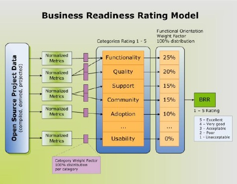
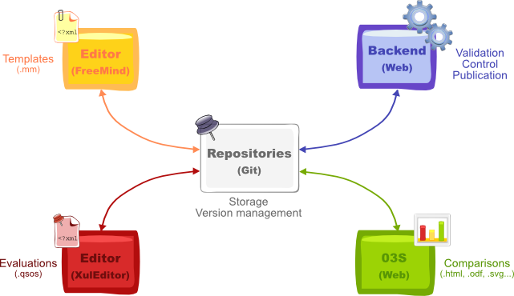

# Evaluation models

This chapter describes some of the evaluation models that can be used for FOSS projects. We will focus on quantitative models, since they are easier to apply and replicate, and probably, more useful. This does not mean that qualitative models are not important. But since they are more based on qualitative perception, they are very dependent on the expertise and familiarity of the expert performing the evaluation. Quantitative models try to be more independent from the person doing the analysis, but defining quantitative data that tries to capture the relevant aspects of the project being evaluated.

Of course, there are shadows in a continuum ranging from pure quantitative to pure qualitative. In fact, the models mentioned in this section may have some aspects which are at least partially qualitative.

## Basics of quantitative evaluation

Quantitative evaluation is based on the identification of quantitative parameters that can be significant, and the definition of measurement models for them.

## OpenBRR

The OpenBRR (Open Business Readiness Rating) is an evaluation method proposed in 2005 and sponsored most notably by Carnegie Mellon and some industrial partners (CodeZoo, SpikeSource and Intel) (The OpenBRR withe paper: http://docencia.etsit.urjc.es/moodle/mod/resource/view.php?id=4343). The goal of this method is to provide an objective manner to assess community-driven projects, offering a final quantitative mark that is intended to provide a measure of its readiness to be deployed in a business environment.

Following figure provides an overview of the how OpenBRR should be applied.

OpenBRR is based on gathering metrics and factual data on up to following ten categories:

* Functionality
* Usability
* Quality
* Security
* Performance
* Scalability
* Architecture
* Support
* Documentation
* Adoption
* Community
* Professionalism

For each category, a set of criteria and metrics are proposed. These inputs are then weighted and each of the above introduced categories are given a rating that ranges from 1 to 5. Then, depending on the final usage the software will be given, adopters may weight these categories, obtaining an overall rating of the project. Hence, not all categories are weighted equally, and for some scenarios a category may not be considered at all for the final rating (in that case, its weight factor would be 0\%).

To help in the assessment, OpenBRR offers a spreadsheet template (a copy of it can be obtained from http://docencia.etsit.urjc.es/moodle/mod/resource/view.php?id=4350) that can be used in the evaluation process. Many of the input data in this model are to be obtained by external tools or from the Internet. As an example, the quality category considers the following inputs:

* Number of minor releases in past 12 months
* Number of point/patch releases in past 12 months
* Number of open bugs for the last 6 months
* Number of bugs fixed in last 6 months (compared to # of bugs opened)
* Number of P1/critical bugs opened
* Average bug age for P1 in last 6 months

These inputs are rated as well from 1 to 5, and the evaluator may then weight them accordingly to her goals.

Although OpenBRR is one of the most known assessment models, it has not achieved to create a thriving community and currently it seems to have come to a halt.

## QSOS

QSOS (Qualification and Selection of Open Source software) is an assessment methodology proposed by ATOS Origin in 2004. It is composed of a formal method that describes a workflow to evaluate proejcts, a set of tools that help to apply the QSOS workflow and a community.

The proposed process is shown in the figure below. It is divided in four iterative steps. The first one is concerned with defining the evaluation criteria in two axes: the project maturity, following some given and mandatory criteria proposed by the QSOS framework that are valid for any type of software, and the functional coverage of the software, with criteria that depend on the software family the project belongs to. The second step involves the evaluation of the projects by obtaining data and measures from the project; raw evaluations are the output of this step. The results of the second step are then weighted depending on the context and the requirements under which the software will be used; specifically this is done by setting weights and filters. The final step is the selection of the most relevant software solution, by comparing the result obtained by several candidate software projects.

The QSOS framework offers a set of tools that help users follow the assessment process. Among them, there is an editor (the Freemind well-known minmapping tool) the create evaluation templates. These templates can then be used for the evaluation of a project using a Firefox extension or a stand-alon application. QSOS offers a web backend service where templates and evaluations can be made public and shared. Finally, O3S is a web-based tool that allows to manipulate evaluations, perform comparisons and export them in various formats.

## SQO-OSS

## Open Source Maturity Model

## OpenBQR

## Qualoss

## The Polarsys Maturity Model

## The Apache Maturity Model

## OpenStack Tags

