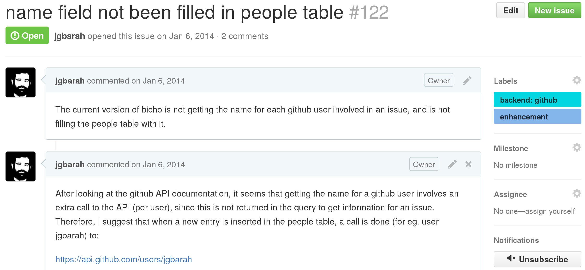
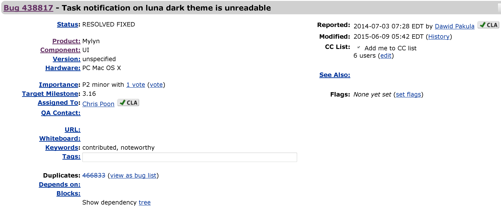
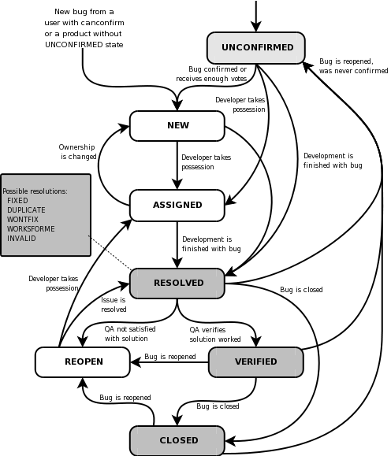
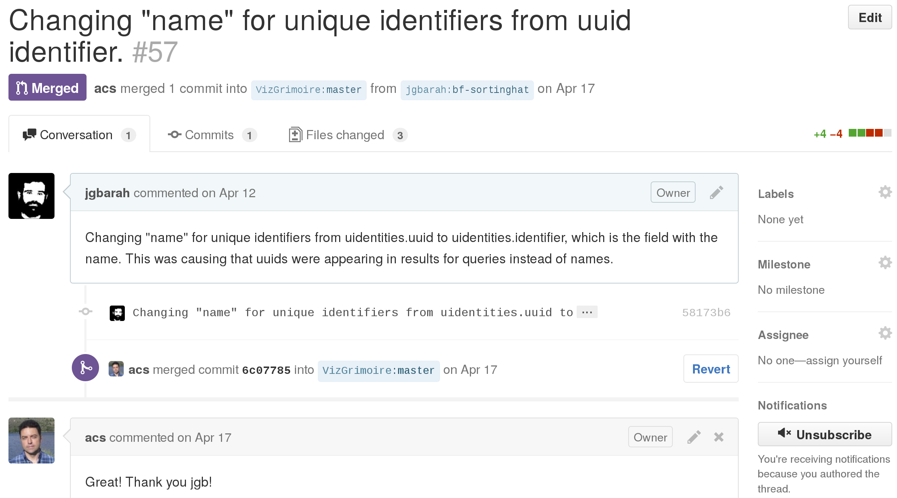

# Sources of information

When evaluating FOSS projects there are many potential sources of information, which in many cases, and specially when the project follows the open development paradigm, are public. Some of these sources are:

* Source code management systems (SCM), such as git, Mercurial or Subversion. All changes to the source code, and in some cases, to documentation and other related artifacts, are stored in them. From these systems we can extract any past version of the source code, which allows for code analysis, code inspection, etc. SCM systems store metainformation for every change, which usually includes who authored and committed it, when, the files involved with the corresponding diffs, etc.
* Issue tracking systems (ITS), also names ticketing systems or bug reporting systems, although they are used for much more than reporting bugs. Most projects use them for tracking how bugs are reported and fixed, and how new functionality is proposed, defined and built. But they can also use ITS for tracking the policy decision or the code review process, or even for tracking how the infrastructure is managed. Their repositories are usually modeled as tickets, which experiment changes in state until they are closed. Some examples are Bugzilla, Lanuchpad, GitHub Issues, Allura Tickets, Trac or RedMine.
* Code review systems (CRS). Used to track the code review process. They are usually modeled very similar to ITS, but specialized for code review, and in many cases integrated with SCM. Some examples are Gerrit and GitHub Pull Requests.
* Asynchronous communication systems (ACS). The most classical ones are mailing lists and forums. But more recently others are emerging, such as question/answer systems, of which StackOverflow and Askbot are good examples. The repositories for ACSs are usually modeled as messages, grouped in threads, either implicit or explicit. Each message includes content, but also metainformation such as author, date, etc.
* Synchronous communication systems (SCS). Some examples of them are IRC or more recently, Slack.
* Testing and continuous integration systems (TCI). Some examples are Jenkins, Hudson and TravisCI.
* Web sites and other repositories for content related to the project. They may include documentation, download areas with binaries ready to run, etc.

All these systems usually offer means for persons to interact with them, which can be used to get a first hand impression of how the project is using them. Qualitative evaluations can benefit from this kind of browsing of information. This can be done, for example, by reading comments in commit records, messages in mailing list archives or IRC logs, or the history of tickets in ITSs.

It is also possible to use tools to retrieve information from them, usually via APIs designed for that matter. This allows for the automated retrieval of information for performing quantitative evaluation, or for storing all the data in a database for further analysis.

## Source code management systems

Information in SCMs is usually organized in "changes", which in most systems are named "commits". The information stored with each change is different for different SCM systems, but it always incude the change itself (some way of identifying which lines were affected by the change, and how), and some metainformation. The metainformation is about who and when produced the change, and some other information related to it. For example, in the case of git, that metainformation associated with each change includes:

* A unique identifier for the commit (dubbed the "commit hash").
* The commit id of the previous commit(s) in the history of the repository.
* An identifier for the author (the person writing the change).
* An identifier for the committer (the person committing the change to the repository).
* Dates for authoring and committing actions.
* A comment produced by the author of the change.
* Complete diff with the changes (differences introduced by the change with respect to the previous situation).

### An example of a git commit record

To illustrate how to obtain this information, see below an example. It is the information in a git commit record, as produced using the command ```git show --pretty=fuller``` for a commit in the CVSAnalY repository (excluding the diff):

```
commit 364f67f13b0046c0a0a688b30a1341ff9946ac26
Author:     Santiago Dueñas <sduenas@bitergia.com>
AuthorDate: Fri Oct 11 12:55:44 2013 +0200
Commit:     Santiago Dueñas <sduenas@bitergia.com>
CommitDate: Fri Oct 11 12:55:44 2013 +0200

    [db] Add author's commit date
    
    Some SCMs, like Git, make a distinction between the dates when
    the committer and author pushed the changes.
    ...
```

The first line shows the commit hash, the next four are the authoring and committing identifiers and dates. In this case, author and committer are the same person, and authoring adn committing dates are the same. After those come several lines with the comment produced by the author, describing the change. After the comment comes the diff, with the list of changes (which were ommitted in the snippet, see below).

The raw information in the commit record can be obtained with ```git show --pretty=raw```:

```
commit 364f67f13b0046c0a0a688b30a1341ff9946ac26
tree c121da67fcba250490b6b326deae46f041b76626
parent 99acc4d7762e3773751f17ae9f0b58169f5e4de0
author Santiago Dueñas <sduenas@bitergia.com> 1381488944 +0200
committer Santiago Dueñas <sduenas@bitergia.com> 1381488944 +0200

    [db] Add author's commit date
    
    Some SCMs, like Git, make a distinction between the dates when
    the committer and author pushed the changes.
    ...
```

This format is harder to read for humans, but includes more information (such as the previous commit, or "parent"), and is therefore more useful for mining data.

The first lines of the diff that was omitted for the above commit are shown below:

```diff
diff --git a/pycvsanaly2/DBContentHandler.py b/pycvsanaly2/DBContentHandler.py
index 579e103..4b0066d 100644
--- a/pycvsanaly2/DBContentHandler.py
+++ b/pycvsanaly2/DBContentHandler.py
@@ -149,7 +149,7 @@ class DBContentHandler (ContentHandler):
             self.actions = []
             profiler_stop ("Inserting actions for repository %d", (self.repo_id,))
         if self.commits:
-            commits = [(c.id, c.rev, c.committer, c.author, c.date, c.message, c.composed_rev, c.repository_id) for c in self.commits]
+            commits = [(c.id, c.rev, c.committer, c.author, c.date, c.author_date, c.message, c.composed_rev, c.repository_id) for c in self.commits]
             profiler_start ("Inserting commits for repository %d", (self.repo_id,))
             cursor.executemany (statement (DBLog.__insert__, self.db.place_holder), commits)
             self.commits = []
diff --git a/pycvsanaly2/Database.py b/pycvsanaly2/Database.py
index dacf406..9b02909 100644
--- a/pycvsanaly2/Database.py
+++ b/pycvsanaly2/Database.py
```

The first lines of the diff shows how to invoke the diff command to produce the output for the first file changed by the commit (a refers to the situation before the change, b to the situation after the change). Lines changed are those starting with - (removed) or + (added). In this case, a change in a line is modeled as removing the old line and adding a new one with the change.

### Notes on using information from SCM systems

Identifiers for authors and committers are usually a name and an email address. But in some cases, such as Subversion, only a user name is available.

In decentraliized SCMs, such as git, dates for authoring and committing include local timezones, usually those of the computer in which the corresponding action was performed. This allows for timezone analysis to infer regions where developers work. In addition, since times are local, studies on daily schedules can also be performed. But in the case of centralized SCMs, such as Subversion, those dates are for the server where commits took place, which means that no information about local time for developers is avilable.

The information in the SCM allows for the reconstruction of the whole history of the repository. In the case of git, the information about the previous commit or commits (in the case of merges, there is nore than one previous commit) allows for the recovery of the full history of the repository. Using that information and some other hints, you can decide to which branch a change was committed.

The complete diff whcih is available for each change allows for the complete reconstruction of the code modifications, which is the ultimate reason for storing it. But it can be used for infering the files involved, the size of the change, and other parameters.

It is important to note that, from a historical point of view, the information provided by the SCM system is now always reliable. For example, in the case of git, developers can "rewrite" history, when they ammend or rebase. Therefore, a current retrieval of information from a git repository may show different data for some commits in the past than a similar retrieval done some time ago, or even a dfferent list of commits. For systems which only commit with an automated tool after code review, which checks and forbids history rewrites, this is not an issue. But most projects do not have specific rules or technical measueres to avoid history rewrittings, and therefore any results about past history need to be understood as "current past history".

## Issue tracking systems

Information in issue tracking systems is usually organized in "tickets". This is why they are also called ticketing systems. In fact, the job of the ITS is to track the changes to each ticket. Therefore, most ITS maintain both a record for each ticket with its current state, and a history of all changes to their state, or a list of past states.

The information usually found for a ticket is:

* Identifier. Unique identifier for each ticket.
* Summary. A one line text summarizing the purpose of the ticket.
* Description. A longer description of the purpose of the ticket. This can be reporting a bug, requesting a feature, or starting a new task, for example.
* Opening date. When the ticket was opened.
* Ticker opener. An identifier for the person opening the ticket. Depending on the ITS, this can be a full name, an email address, or a user name.
* Ticket asignee. The person asigned by the project to deal with the ticket.
* Priority. A number or a text informing about the priority for the ticket. This is usually set by the ticket opener, but can be later adjusted by developers.
* State. A tag with the current state of the ticket. Examples of states are "open" (ticket opened, but still not dealt with by the project), "assigned" (ticket already assigned to some developer),  "fixed" (ticket is considered to be fixed), "closed" (the issue is considered to be done).

Almost all fields in the ticket are subject to changes. When this happens, the change is recorded, including information about who made the change, when, and what the change was about.

In addition, a ticket usually have an associated list of comments. These comments are posted by the different persons who contribute to close the ticket. Some of them may be from the ticket opener, such as when a clarification is posted. Some others may be from people interested in the ticket, such as other people experiencing the same problem. Some others may be by developers trying to solve the issue. Each comment is composed by some text (the comment itself), the posting date, the author of the comment, and maybe some other fields.

But despite having a similar structure, tickets in different ITS may be presented to users in very different ways, as is shown in the next examples.

### Example of ticket in GitHub

In GitHub, tickets are called "issues". They are presented in a single HTML page, showing the description, history and comments in it. Most of the current state is shown in the right column.


*Example of ticket: [GitHub issue from the Bicho project](https://github.com/MetricsGrimoire/Bicho/issues/122). The most relevant fields can be observed. The first text on the left column is the description of the ticket, the second one is a comment.*

GitHub also provides the same information via the [GitHub Issues API](https://developer.github.com/v3/issues/), which is easier to use for automated retrieval of information.

### Example of ticket in Bugzilla

In Bugzilla tickets are called "bugs". Bugzilla is one of the earliest free software ITS, and is currently in use by some very large communities, such as Eclipse. In the following example, the status information for a ticket is shown. Below that area, the list of comments to the ticket is found, starting by its description.


*Example of ticket: [Bugzilla issue from the Eclipse Mylin project](https://bugs.eclipse.org/bugs/show_bug.cgi?id=438817). Comments come below this status information.*

Bugzilla provides similar information via an XML file, which is more suitable for automated retrieval.

### Notes on using information from an ITS

First of all, it is important to notice that projects may use tickets for many different kinds of actions. The most known one is reporting a bug, and that's the reason why these systems are also called "bug reporting systems". But tickets may refer to feature requests, tasks being performed, or even policy discussions. It is up to the policies and uses of a project to decide what kind of communication they channel through the ITS, and that varies a lot from project to project. Therefore, counts on for example "open tickets" are different from counts on "open bugs".

ITSs are also very different on which kind of information they store, and what does it mean. For example, all of them include some kind of encoding the "state" of the ticket. But while GitHub uses tags for that, Bugzilla uses a "status" field. In addition, each project may use this information in different ways, and in many cases they define their own tags, status fields, or whatever the ITS uses for this. That makes it very difficult to know at first sight even when a ticket is a bug, or when a bug is actually fixed. The workflow for tickets, and how and who can move them from state to state, is usually project-defined,although the ITS may constrain or recommend about it. For example, the next figure shows the recommended workflow for Bugzilla.


*[Recommended workflow in Bugzilla](https://www.bugzilla.org/docs/3.6/en/html/lifecycle.html). Original figure illustrates [Life Cycle of a Bug](https://www.bugzilla.org/docs/3.6/en/html/lifecycle.html), in [The Bugzilla Guide - 3.6.13 Release](https://www.bugzilla.org/docs/3.6/en/html/index.html) distributed under the GNU Free Documentation License.*

This said, ITSs provide a rich information about how the project is dealing with some of its most important development processes. For example, they allow for the calculus of time-to-fix for bugs, or time-to-implementation for feature requests. They allow as well for the identification of the persons carrying on most of the maintenance, or the key developers in implementing some kind of new functionality.

In some cases, the ITS carries too processes such as code review or documentation management, which have their own peculiarities.

## Code review systems

Code review systems are used, as their name implies, for reviewing source code. Changes to code are organized as patches, which are submited by developers to the system, and then commented and reviewed by reviewers. Depending on the project, maybe only some developers can review, or only some can accept or decline changes.

The information structure of a CRS is quite similar to that of ITS. The role of tickets is taken by proposed patches. Proposed patches go through changes in state as the review cycle progresses. Some reviewers propose to accept the change, some others may ask for a new version, finally the change is accepted or maybe abandoned. All of them (reviewers and change proposers) can write comments as well.

Due to this similarity, some projects use the ITS for code review. This is for example the case of WebKit, which uses Bugzilla. But during the last years, specialized systems for code review have been adopted in most cases. The most prominent cases are Gerrit and GitHub Pull Requests.

### Example of code review in Gerrit

Gerrit tracks "changes", usually in combination with git. Each change is a commit, which is reviewed by flagging it with +1 (proposal for accepting the change) or -1 (proposal for asking for a new version of the change). Each version of a change is called "patchset", and the developer is expected to submit one patchset after another until reviewers are happy with the change. In this case, the acceptance of the change is signalled by flaging it with +2. Gerrit can be tuned to the specific policies of a project, so that for example a certain number of +2 is needed to accept (merge) a change, or that only core reviewers can flag a change with +2.


*Example of code review: [Gerrit code review for OpenStack](https://review.openstack.org/#/c/191195/)*

Gerrit can also be connected with testing and continuous integration systems, so that automated tests are run before and after a change is reviewed. A change submitted to Gerrit finishes its review process, possibly after several patchsets are submitted,  when it is accepted (merged), or when the developer decides to withold it (abandon).

### Example of code review in GitHub

In GitHub, code review is done via "pull requests", which are a kind of specialized tickets (issues). The process starts when a developer submits a change. To prepare for that, they usually have previously forked the corresponding git repository, and committed the proposed change to it. Then, that commit can be proposed for pull request via the GitHub web interface. Once it is proposed, it appears to GitHub users as a ticket, with the peculiarity that the corresponding change can be explored, commented, and merged.


*Example of code review: [GitHub pull request](https://github.com/VizGrimoire/GrimoireLib/pull/57)*

GitHub does not allow for tracking different versions of the change. In fact, different versions can be submitted, by changing the commit (eg, ammending it). But that information is lost when the corresponding ticket is browsed: only the last version of the change is available.

Since a pull request is really a ticket, it can also be labeled, assigned, closed, etc. 

### Notes on using information from a CRS

CRS are very important when tracking processes in software development. When a project uses mandatory code review, any new piece of code has to be through the CRS, which tracks times, people involved, etc. Therefore the information mined from it can be used to learn about how long does code review lasts, and who is responsible for delays in code review: developers who fail to submit quiclly new versions of a change, or reviewers who are slow in reviewing it.

People involved in review processes is also a very interesting information. Commit records only keep information about the author and maybe the person merging the commit. Code review provides a much more detailed information: all people commenting, or proposing approval or decline of chaneges are tracked. In addition, CRS usually provide links with testing and continuous integration (CI) systems, which may say a lot about how good proposed changes are.

In many cases, tickets refering bug reports or feture requests corresponding to the change are linked as well. This allows for more complete analysis of all the development process. For example, that allows to track, since the moment a bug is reported to when a fix is proposed, how it evolves to the final merged change, how it finally passes the CI tests, until it is ready for deployment in production environments.

## Asynchronous communication systems


## Synchronous communication systems


## Testing and continuous integration systems
